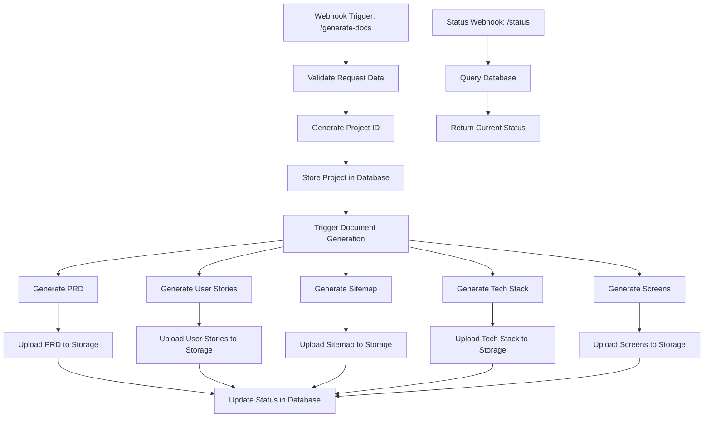

# N8N Webhook Integration Guide

## 📋 Implementation Status

### ✅ **WEBHOOK IMPLEMENTATION COMPLETE**

Both webhook calls have been **fully implemented** and are ready for N8N integration:

#### 1. **POST Webhook (Project Submission)** ✅
- **Location**: `lib/webhook.ts` - `submitProjectGeneration()` function
- **Functionality**: Sends project form data to N8N workflow
- **Integration Point**: `app/dashboard/page.tsx` - triggers on "Generate Documentation Suite" button
- **Status**: **READY FOR PRODUCTION**

#### 2. **GET Webhook (Status Polling)** ✅
- **Location**: `lib/webhook.ts` - `getGenerationStatus()` and `pollGenerationStatus()` functions
- **Functionality**: Polls N8N for real-time generation status and document URLs
- **Integration Point**: `components/GenerationProgress.tsx` - real-time progress updates
- **Status**: **READY FOR PRODUCTION**

#### 3. **UI Integration** ✅
- **Dashboard Form**: Complete project submission interface
- **Progress Tracking**: Real-time status updates with visual indicators
- **Document Display**: Ready to display completed documents with download links
- **Error Handling**: Comprehensive error states and user feedback
- **Status**: **READY FOR PRODUCTION**

---

## 🚀 Quick Setup Checklist

- [ ] Update `.env.local` with your N8N webhook URLs
- [ ] Set `NODE_ENV=production` to enable real webhooks
- [ ] Configure N8N workflows following the specifications below
- [ ] Test integration using the dashboard form

---

## 🔧 Environment Configuration

### Required Environment Variables

Create/update your `.env.local` file:

```env
# N8N Webhook Configuration (REQUIRED)
NEXT_PUBLIC_N8N_WEBHOOK_URL=https://your-n8n-instance.com/webhook/generate-docs
NEXT_PUBLIC_N8N_STATUS_WEBHOOK_URL=https://your-n8n-instance.com/webhook/status

# Environment Mode (Set to 'production' for real webhooks)
NODE_ENV=production

# Optional: Authentication & Database
NEXT_PUBLIC_CLERK_PUBLISHABLE_KEY=your_clerk_key
CLERK_SECRET_KEY=your_clerk_secret
NEXT_PUBLIC_SUPABASE_URL=your_supabase_url
NEXT_PUBLIC_SUPABASE_ANON_KEY=your_supabase_key
```

### Development vs Production

- **Development Mode** (`NODE_ENV=development`): Uses mock functions with localStorage simulation
- **Production Mode** (`NODE_ENV=production`): Uses real N8N webhook endpoints

---

## 📡 Webhook Specifications

### 1. POST Webhook - Project Submission

#### Endpoint Configuration
- **URL**: `/webhook/generate-docs`
- **Method**: `POST`
- **Content-Type**: `application/json`

#### Request Payload Structure
```json
{
  "projectName": "My Awesome Project",
  "description": "Detailed project description from user input",
  "techStack": "Next.js + Supabase + TypeScript",
  "targetPlatform": "web",
  "complexity": "medium",
  "userId": "user_123",
  "timestamp": "2025-01-10T12:00:00.000Z",
  "requestId": "req_1704974400000_abc123xyz"
}
```

#### Field Specifications
| Field | Type | Required | Options | Description |
|-------|------|----------|---------|-------------|
| `projectName` | string | No | - | Optional project name |
| `description` | string | **Yes** | - | Detailed project description (max 2000 chars) |
| `techStack` | string | **Yes** | See tech stack options | Selected technology stack |
| `targetPlatform` | string | **Yes** | `web`, `mobile`, `desktop`, `both` | Target deployment platform |
| `complexity` | string | **Yes** | `simple`, `medium`, `complex` | Project complexity level |
| `userId` | string | No | - | User identifier (if authentication enabled) |
| `timestamp` | string | **Yes** | ISO 8601 | Request submission timestamp |
| `requestId` | string | **Yes** | - | Unique request identifier |

#### Available Tech Stack Options
```json
[
  { "value": "react-node", "label": "React + Node.js + MongoDB" },
  { "value": "nextjs-supabase", "label": "Next.js + Supabase + TypeScript" },
  { "value": "vue-laravel", "label": "Vue.js + Laravel + MySQL" },
  { "value": "angular-dotnet", "label": "Angular + .NET Core + SQL Server" },
  { "value": "svelte-express", "label": "Svelte + Express.js + PostgreSQL" },
  { "value": "flutter-firebase", "label": "Flutter + Firebase + Firestore" },
  { "value": "react-native-expo", "label": "React Native + Expo + GraphQL" },
  { "value": "django-react", "label": "Django + React + PostgreSQL" },
  { "value": "rails-vue", "label": "Ruby on Rails + Vue.js + Redis" },
  { "value": "spring-boot-react", "label": "Spring Boot + React + MySQL" }
]
```

#### Expected Response
```json
{
  "projectId": "project_unique_id_123",
  "status": "accepted",
  "message": "Project submitted for generation"
}
```

### 2. GET Webhook - Status Polling

#### Endpoint Configuration
- **URL**: `/webhook/status?projectId={projectId}`
- **Method**: `GET`
- **Query Parameter**: `projectId` (required)

#### Expected Response Structure
```json
{
  "projectId": "project_unique_id_123",
  "status": "processing",
  "progress": 65,
  "currentStep": "Generating User Journey Document...",
  "estimatedTime": 120000,
  "documents": [
    {
      "type": "PRD",
      "name": "Product Requirements Document",
      "status": "completed",
      "downloadUrl": "https://your-storage.com/documents/prd_123.pdf",
      "size": "2.3 MB"
    },
    {
      "type": "User Stories",
      "name": "User Journey Document", 
      "status": "processing",
      "downloadUrl": null,
      "size": null
    },
    {
      "type": "Sitemap",
      "name": "Application Sitemap",
      "status": "pending",
      "downloadUrl": null,
      "size": null
    },
    {
      "type": "Tech Stack",
      "name": "Technology Requirements",
      "status": "pending",
      "downloadUrl": null,
      "size": null
    },
    {
      "type": "Screens",
      "name": "Screen Specifications",
      "status": "pending",
      "downloadUrl": null,
      "size": null
    }
  ]
}
```

#### Status Field Specifications
| Field | Type | Description |
|-------|------|-------------|
| `projectId` | string | Unique project identifier |
| `status` | enum | `pending`, `processing`, `completed`, `failed` |
| `progress` | number | Progress percentage (0-100) |
| `currentStep` | string | Current generation step description |
| `estimatedTime` | number | Estimated time remaining in milliseconds |
| `documents` | array | Array of document generation statuses |

#### Document Status Structure
| Field | Type | Description |
|-------|------|-------------|
| `type` | enum | `PRD`, `User Stories`, `Sitemap`, `Tech Stack`, `Screens` |
| `name` | string | Human-readable document name |
| `status` | enum | `pending`, `processing`, `completed`, `failed` |
| `downloadUrl` | string/null | Download URL when completed |
| `size` | string/null | File size when completed |

---

## 📑 Document Generation Requirements

Your N8N workflow must generate these 5 document types:

### 1. **PRD (Product Requirements Document)**
- **Type**: `"PRD"`
- **Name**: `"Product Requirements Document"`
- **Content Requirements**:
  - Comprehensive feature specifications
  - User requirements and acceptance criteria
  - Technical constraints and assumptions
  - Functional and non-functional requirements

### 2. **User Stories/Journey Document**
- **Type**: `"User Stories"`
- **Name**: `"User Journey Document"`
- **Content Requirements**:
  - User personas and scenarios
  - User flow diagrams
  - Interaction patterns
  - User acceptance criteria

### 3. **Sitemap Document**
- **Type**: `"Sitemap"`
- **Name**: `"Application Sitemap"`
- **Content Requirements**:
  - Application structure hierarchy
  - Navigation flow
  - Page relationships
  - URL structure recommendations

### 4. **Tech Stack Requirements**
- **Type**: `"Tech Stack"`
- **Name**: `"Technology Requirements"`
- **Content Requirements**:
  - Technology recommendations based on selected stack
  - Architecture decisions
  - Compatibility analysis
  - Development environment setup

### 5. **Screen Specifications**
- **Type**: `"Screens"`
- **Name**: `"Screen Specifications"`
- **Content Requirements**:
  - Detailed screen layouts
  - Content requirements for each screen
  - Functionality specifications
  - UI/UX considerations

---

## 🏗️ N8N Workflow Architecture

### Recommended Workflow Structure



### Node Configuration Guide

#### 1. **POST Webhook Setup**
1. **Webhook Trigger Node**:
   - Path: `/webhook/generate-docs`
   - Method: `POST`
   - Response Mode: `Immediately`

2. **Data Validation Node**:
   - Validate required fields
   - Check data types and constraints
   - Generate error responses for invalid data

3. **Project ID Generation Node**:
   - Generate unique project identifier
   - Format: `project_{timestamp}_{random}`

4. **Database Storage Node**:
   - Store project details
   - Initialize document statuses as 'pending'
   - Set overall status to 'pending'

5. **Document Generation Trigger**:
   - Parallel execution for all 5 documents
   - Use AI/LLM services for content generation
   - Update status to 'processing'

6. **Response Node**:
   - Return project ID and acceptance confirmation

#### 2. **GET Status Webhook Setup**
1. **HTTP Request Node**:
   - Handle GET requests
   - Extract projectId from query parameters

2. **Database Query Node**:
   - Fetch current project status
   - Retrieve document generation progress

3. **File Storage Check**:
   - Verify document completion
   - Generate secure download URLs
   - Calculate file sizes

4. **Response Assembly**:
   - Format response according to specification
   - Include all document statuses
   - Calculate overall progress percentage

---

## 🧪 Testing & Validation

### Testing the POST Webhook
1. **Frontend Testing**:
   - Navigate to `/dashboard`
   - Fill out the project form
   - Click "Generate Documentation Suite"
   - Monitor browser network tab for request/response

2. **Direct API Testing**:
   ```bash
   curl -X POST https://your-n8n-instance.com/webhook/generate-docs \
     -H "Content-Type: application/json" \
     -d '{
       "description": "Test project description",
       "techStack": "Next.js + Supabase + TypeScript",
       "targetPlatform": "web",
       "complexity": "medium",
       "timestamp": "2025-01-10T12:00:00.000Z",
       "requestId": "test_req_123"
     }'
   ```

### Testing the GET Webhook
1. **Frontend Testing**:
   - Submit a project via dashboard
   - Monitor the GenerationProgress component
   - Verify real-time status updates

2. **Direct API Testing**:
   ```bash
   curl "https://your-n8n-instance.com/webhook/status?projectId=project_123"
   ```

### Expected Test Scenarios
- [ ] Successful project submission
- [ ] Invalid data rejection
- [ ] Status polling with various project states
- [ ] Document completion with download URLs
- [ ] Error handling for failed generations
- [ ] Timeout handling for long-running processes

---

## 🚨 Error Handling

### Frontend Error Handling
The frontend includes comprehensive error handling:

- **Network Failures**: Automatic retry with exponential backoff
- **Timeout Handling**: 5-minute maximum generation time
- **Invalid Responses**: User-friendly error messages
- **Status Polling Errors**: Graceful degradation with manual refresh option

### Required N8N Error Responses

#### POST Webhook Errors
```json
{
  "error": "validation_failed",
  "message": "Description is required",
  "code": 400
}
```

#### GET Webhook Errors
```json
{
  "error": "project_not_found",
  "message": "Project with ID project_123 not found",
  "code": 404
}
```

---

## 📊 Monitoring & Analytics

### Recommended Tracking
- Project submission rates
- Generation success/failure rates
- Average generation time per document type
- User engagement with generated documents
- Popular tech stack combinations

### Logging Requirements
- All webhook requests/responses
- Document generation start/completion times
- Error occurrences with stack traces
- User interaction patterns

---

## 🔄 Production Deployment

### Pre-Deployment Checklist
- [ ] N8N workflows tested and validated
- [ ] Environment variables configured
- [ ] Database schema ready
- [ ] File storage configured
- [ ] Error monitoring setup
- [ ] Performance testing completed

### Go-Live Steps
1. Update `.env.local` with production N8N URLs
2. Set `NODE_ENV=production`
3. Deploy frontend application
4. Monitor initial requests for issues
5. Verify document generation pipeline

---

## 🛠️ Troubleshooting

### Common Issues

#### "Failed to submit project for generation"
- **Cause**: N8N webhook URL incorrect or unreachable
- **Solution**: Verify `NEXT_PUBLIC_N8N_WEBHOOK_URL` in `.env.local`

#### "Failed to get project status"
- **Cause**: Status webhook not responding or incorrect projectId
- **Solution**: Check `NEXT_PUBLIC_N8N_STATUS_WEBHOOK_URL` and N8N workflow

#### "Generation timeout"
- **Cause**: Document generation taking longer than 5 minutes
- **Solution**: Optimize N8N workflow or increase timeout in `pollGenerationStatus()`

#### Mock mode still active in production
- **Cause**: `NODE_ENV` not set to 'production'
- **Solution**: Ensure `NODE_ENV=production` in environment variables

### Debug Mode
Enable detailed logging by adding to `.env.local`:
```env
NEXT_PUBLIC_DEBUG_WEBHOOKS=true
```

---

## 📚 Code References

### Key Files
- **Webhook Implementation**: [`lib/webhook.ts`](./lib/webhook.ts)
- **Dashboard Integration**: [`app/dashboard/page.tsx`](./app/dashboard/page.tsx)
- **Progress Component**: [`components/GenerationProgress.tsx`](./components/GenerationProgress.tsx)
- **Environment Config**: [`.env.local`](./.env.local)

### Important Functions
- `submitProjectGeneration()` - Sends project to N8N
- `getGenerationStatus()` - Fetches current status
- `pollGenerationStatus()` - Automated status polling with backoff
- `webhookAPI` - Environment-aware API selector

---

**Status**: ✅ **IMPLEMENTATION COMPLETE - READY FOR N8N INTEGRATION**

*Last Updated: January 10, 2025*